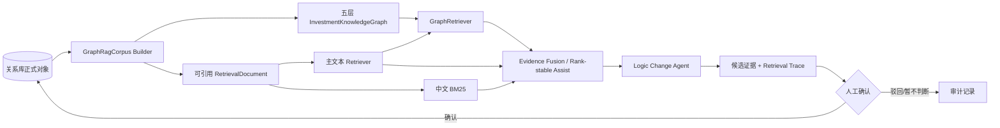

# AI Investment Copilot Graph RAG 技术全景

版本日期：2026-08-30  
适用范围：当前仓库的 Graph RAG 代码、离线评测、产品接入和发布门禁  
结论口径：**v6 专业研究员唯一一次盲测 14/14 通过，质量中心 READY；产品默认开启 Graph RAG
与 Evidence Fusion，同时保留人工闸门、文本回退和线上安全监控。**

## 1. 一页结论

当前 Graph RAG 不是通用知识问答系统，也不是让模型自行规划检索步骤的 Agentic RAG。它是面向
投资研究工作流的、确定性且可审计的检索增强层：把关系库中已经存在的证券、投资逻辑、假设、
业务变量、指标、指标观测、事件、证据、文档和原文片段，投影成一张只读内存图，再用图路径帮助
找到可回查的原文证据。

产品口径已经简化为“一家公司维护一条投资逻辑”。Graph RAG 因此不是在同一公司内挑选多条
投资逻辑，而是围绕唯一逻辑的假设、变量和指标，解释新事实如何传导到这条逻辑；观点变化通过
同一逻辑的修订和不可变版本演进。

当前实现同时保留两种运行策略：

1. `graph-assist-rank-stable-v1`：保持文本 Top-K 顺序，Graph 只附加路径，并在文本不足 K 条时
   回填。它是 v5 正式盲测所用策略，当前保留为兼容和紧急降级模式。
2. `graph-evidence-fusion-v1`：在受控候选池内，以确定性 RRF 融合主文本、中文 BM25 和 Graph
   三个分支，Graph 权重最高，并给高证据密度财报固定先验。它已通过 v6 并成为默认策略。

二者的发布状态不同：

| 项目 | 当前状态 |
| --- | --- |
| 图谱投影、路径检索、文本融合、检索追踪 | 已实现 |
| 产品开关 `RAG_GRAPH_ENABLED` | 默认 `true` |
| 兼容开关 `RAG_GRAPH_ASSIST_ONLY` | 默认 `false` |
| v5 正式一次性盲测 | 12/14，Recall@5 与 NDCG@5 未过 |
| v6 正式一次性盲测 | 14/14，Recall@5 0.8247、NDCG@5 0.8076 |
| 质量中心 | `READY` |
| 当前阶段 | Graph RAG 已开启，进入在线观测与受控放量验收 |

## 2. 系统边界与设计原则

### 2.1 关系库仍是事实源

Graph RAG 不新建一套业务主数据，也不把图计算结果写回正式关系。图由 Unit of Work 中的正式
对象在运行时只读构建；人工确认、权限校验、版本和审计仍由服务层及关系库负责。

这意味着：

- AI 候选不会因为进入图就自动变成正式证据；
- 默认只投影已确认的指标映射、证据关系和原文引用；
- 待确认关系只有在显式设置 `include_pending=true` 时才进入图，而且边仍携带 `confirmed=false`；
- 图检索只返回能够落到 `locator` 的原文片段，图节点本身不能代替引用；
- Graph RAG 不承担状态自动变更、数值计算或投资结论生成。

### 2.2 当前不是图数据库架构

当前的 `InvestmentKnowledgeGraph` 是确定性内存图：节点保存在字典中，边同时写入邻接表，构建
完成后交给 Retriever 使用。没有引入 Neo4j、NebulaGraph 或其他图数据库。

这是当前阶段的主动选择：先固定图语义、权限边界、时间边界、路径可解释性和评测协议，避免在
语义尚未稳定时引入额外基础设施。后续若数据规模和并发需要图数据库，Retriever 和图快照契约
可以保留，底层存储可替换。

### 2.3 Graph 不是 Agentic RAG

路径搜索使用固定种子、固定边权、固定跳数和固定停止条件。模型不能自行改变跳数、创建边、绕开
权限，或循环检索直到“满意”。因此同一图快照、同一查询和同一配置可以复现同一排序及路径解释。

## 3. 总体架构



核心数据流可概括为：

```text
正式对象
  → 只读图投影与快照
  → 文本候选召回
  → 查询/文本结果形成图种子
  → 多跳图路径回到原文片段
  → 文本、BM25、Graph 排名融合
  → 候选证据与可解释检索追踪
  → 人工确认后才形成正式关系
```

## 4. 图是怎样构建的

### 4.1 五层知识模型

节点类型被强制映射到固定知识层；节点若声明到错误层，构建时直接报错。

| 知识层 | 节点类型 | 作用 | 当前投影来源 |
| --- | --- | --- | --- |
| 原始证据层 | 文档、原文片段 | 提供最终可回查引用 | 文档与切片仓储 |
| 事实观测层 | 事件、事实、指标观测 | 表达披露事件、抽取事实和时点数值 | 事件、事实、指标观测仓储 |
| 领域语义层 | 业务变量、指标 | 连接研究语言与可测量口径 | 假设派生变量、指标定义、受控别名表 |
| 投资研究层 | 证券、投资逻辑、投资假设、证据 | 表达公司研究框架和人工确认关系 | 唯一投资逻辑、假设、证据关系 |
| 聚合摘要层 | 聚合摘要 | 为后续增量摘要预留 | 当前构建器通常不生成，节点数可以为 0 |

五层的目的不是增加概念数量，而是限制路径语义。例如“假设 → 变量 → 指标 → 事实 → 原文”是
持续向下钻取；检索器不允许路径先下钻再上钻形成难以解释的语义捷径。

### 4.2 主要节点和边

当前图模式包含 12 类节点、16 类边。常用链路如下：

| 起点 | 关系 | 终点 | 说明 |
| --- | --- | --- | --- |
| 证券 | 拥有逻辑 | 投资逻辑 | 产品层面每个证券最多一条当前投资逻辑 |
| 投资逻辑 | 包含假设 | 投资假设 | 唯一逻辑下的可验证假设 |
| 投资假设 | 依赖变量 | 业务变量 | 将研究表述转成业务驱动因素 |
| 投资假设 / 业务变量 | 由指标衡量 | 指标 | 人工确认的假设—指标映射 |
| 指标 | 包含观测 | 指标观测 | 带期间、数值、单位和数据版本的观测 |
| 指标观测 | 来源于 | 文档 | 观测的原始披露来源 |
| 文档 | 包含片段 | 原文片段 | 可引用的页码/段落定位 |
| 原文片段 | 陈述事实 | 事实 | 从原文抽取且保留 locator 的事实 |
| 事实 | 观测指标 | 指标 | 通过受控指标词表建立确定性匹配 |
| 事实 | 影响变量 | 业务变量 | 从指标映射反向连接到业务变量 |
| 投资假设 | 支持 / 冲突 / 提供背景 | 证据 | 保存证据方向和确认状态 |
| 证据 | 引用原文 | 原文片段 | 正式证据的可回查引用 |
| 证据 | 来源于 | 事件 | 证据对应的变化事件 |
| 事件 | 披露于 | 文档 | 事件来源文档 |
| 聚合摘要 | 汇总 | 其他节点 | 模式已预留，当前主链路未使用 |

图遍历允许沿边的两个方向行走，以便从查询命中的事实回到假设，或从假设向下找到原文；但
`GraphEdge` 始终保存事实边的原始方向，路径元数据用 `反向:<关系>` 明确标记反向遍历。

### 4.3 一条典型图链路

假设研究员查询“需求与出货假设有哪些原文证据”，图可以沿如下链路回到原文：

```text
投资假设：需求持续增长
  --依赖变量--> 业务变量：需求与出货
  --由指标衡量--> 指标：出货量
  <--观测指标-- 事实：本季度出货量同比增长 18%
  <--陈述事实-- 原文片段：DOC-2026-Q2#page=12&paragraph=4
```

另一条已经人工确认的证据链可以是：

```text
投资假设
  --支持/冲突/提供背景--> 证据
  --引用原文--> 原文片段
  <--包含片段-- 文档
```

最终返回的是原文片段及其 locator，而不是“出货量增长”这一图节点的概括文本。

### 4.4 构建顺序

`_CorpusBuilder` 按“研究层 → 语义层 → 观测层 → 来源层”的依赖顺序投影：

1. 读取证券和唯一投资逻辑，创建 `Security → Thesis`。
2. 读取投资假设，创建 `Thesis → Hypothesis → BusinessVariable`。
3. 读取已确认的假设—指标映射，创建 Metric 节点和 `MEASURED_BY` 边。
4. 读取同公司、同指标版本的观测，连接 `Metric → Observation → Document`。
5. 读取已确认的证据关系，连接假设、证据、事件、文档和引用片段。
6. 加载文档切片和事实；此时指标节点已存在，可通过受控别名把事实连接到指标及业务变量。

当前受控指标别名包括营业收入、出货量、平均销售价格、毛利率、订单量、产能利用率等；例如
“营收 / 收入 / revenue”归一到“营业收入”。匹配是确定性字符串标准化，不调用模型创造新关系。

### 4.5 稳定 ID 与图快照

- 业务对象节点 ID 使用“节点类型 + 业务 ID”，例如 `thesis:<id>`、`metric:<id>:<version>`。
- 业务变量没有独立业务 ID 时，使用 `security_id + label` 的 SHA-256 前 16 位形成稳定 ID。
- 同一源节点、目标节点和关系类型只保留一条边，避免重复投影。
- 每个知识层对排序后的节点和出边计算 SHA-256 内容哈希。
- 快照 ID 由图模式版本、构建器版本、词表版本、`as_of`、是否包含待确认关系、逻辑集合、公司
  集合和各层哈希共同确定。

快照清单只保存 ID、版本、时间、各层节点数及哈希，不把无关节点正文复制到证据追踪中。它既
支持审计，也为后续缓存和增量构建提供比较基线。

## 5. 图检索链路如何实现

### 5.1 查询约束先于相关度

每个 `RetrievalQuery` 可以携带四类边界：

- `allowed_document_ids`：上游已经形成封闭候选池时，Graph 只能在池内排序或补强；
- `security_id`：不得跨公司；
- `allowed_visibility`：不得返回研究员无权访问的资料；
- `as_of`：不得使用查询时点之后发布的资料。

这些边界同时应用于文本 Document 和图 Node。构建期还会跳过已删除文档及 `as_of` 之后的
证据、事件、观测和文档。也就是说，权限和时间边界不是最终结果上的一次过滤，而是贯穿建图、
种子选择、每一跳扩展和结果输出。

### 5.2 形成查询种子

GraphRetriever 先把 `top_k` 扩大为候选窗口，再执行文本检索。随后合并三类种子：

1. 调用方显式传入的稳定 `seed_node_ids`，初始分为 1.0；
2. 查询 token 与节点标题/正文有重合的允许节点，初始分为“重合 token 数 / 查询 token 数”；
3. 文本候选对应的 Segment 节点，按文本名次赋分 `1 / rank`。

这样既可以从投资假设定向向下找原文，也可以从查询词或文本命中的原文向上找到结构化关系。

### 5.3 多跳路径搜索

路径扩展使用优先队列，总是先处理当前得分最高的路径。每走一条边：

```text
next_path_score = current_path_score × edge.weight × hop_decay
```

当前默认参数为：

| 参数 | 当前值 | 作用 |
| --- | ---: | --- |
| `max_hops` | 5 | 覆盖“假设—变量—指标—事实—原文” |
| `hop_decay` | 0.82 | 长路径逐跳衰减 |
| `max_expansions` | 5000 | 限制单次图扩展成本 |
| `max_paths_per_chunk` | 3 | 每个原文片段最多保留三条解释路径 |
| `include_unconfirmed_edges` | `false` | 默认不走未确认边 |
| `enforce_layer_monotonicity` | `true` | 一条路径只能持续上钻或持续下钻 |

搜索还禁止在同一路径内重复节点，避免环；同一种子、终点和层级方向只保留更高分状态。只有走到
已加载、权限允许且有 locator 的 Segment 节点时，才形成可返回的 Graph 命中。

### 5.4 Graph 分与路径解释

对同一个 locator，Graph 分取其保留路径中的最高分。GraphRetriever 内部先将文本分归一化，再
按配置融合：

```text
graph_retriever_score(locator)
  = 0.35 × normalized_text_score(locator)
  + 0.65 × best_graph_path_score(locator)
```

权重会归一化，因此配置只需要表达相对比例。每个结果保存：

- 文本分和图分；
- 节点 ID、节点类型和知识层；
- 关系名称及正向/反向；
- 边上的原文 provenance locator；
- 人可读的路径 explanation；
- 本次图快照元数据。

## 6. Graph 如何与文本链路结合

### 6.1 基础文本检索能力

当前 Retriever 契约允许替换文本实现。仓库内已有：

| 文本能力 | 实现口径 |
| --- | --- |
| Keyword | 中英文 token 重合度，完全确定性 |
| 中文 BM25 | 中文连续 2/3-gram，`k1=1.2`、`b=0.75` |
| 本地中文向量 | 版本化的 char-2gram 哈希向量；用于可复现离线消融，不等同于通用语义模型 |
| Controlled Candidate Union | 保持主检索排序，只在不足时用补充分支填充 |
| Announcement Prior | 对非治理查询中的治理类公告降权 |
| Diversity MMR | 降低 Top-K 中近重复公告的占比，`lambda=0.82` |

产品最小链路在普通 Gateway 分支使用 KeywordRetriever；长生命周期 Agent 可以注入其他符合契约
的 Retriever。离线 v5 文本基线则组合了 Keyword、BM25、本地哈希向量、公告类型先验和 MMR。
因此不能把离线基准中的全部文本组件误认为当前线上默认都已启用。

### 6.2 v5：Rank-stable Assist

v5 的策略先分别执行文本和 Graph 检索，然后严格保留文本 Top-K 的顺序和原分数。若同一 locator
在 Graph 分支命中，只给该文本结果附加图路径、图分和快照；只有文本少于 K 条时，才追加有路径
的 Graph 候选。

该策略的优点是风险低、排序稳定率为 1.0；缺点同样明确：如果文本 Top-1 错了，Graph 即使找到
更强路径也不能把正确候选提前。v5 失败分析中，多个错误首位正是被这一规则锁死。

### 6.3 v6 发布策略：Evidence Fusion

发布策略在封闭候选池内分别执行主文本、BM25 和 Graph 三个分支，再按加权倒数排名融合：

```text
score(locator)
  = 0.25 / (1 + rank_text)
  + 0.50 / (1 + rank_bm25)
  + 1.00 / (1 + rank_graph)
  + report_prior(locator)
```

其中：

- `rrf_k=1`；未进入某分支候选窗口的 locator 不获得该分支分数；
- Graph 权重 1.0，是最高权重分支；
- 主文本权重 0.25，用于抵抗图投影遗漏；
- BM25 权重 0.5，强化中文词组匹配；
- 来源标题包含“年度报告、季度报告、中期业绩、全年业绩、财务业绩、年度业绩”时，加固定
  `1 / (1 + 1) = 0.5` 的高证据密度先验；
- 三个分支均在查询的候选池、证券、权限和时间边界内工作；
- 候选窗口为 `top_k × 3`，融合后再截断为 Top-K；
- 同一 locator 有 Graph 结果时优先保留 Graph chunk，以保留路径、分项分和快照；
- 元数据记录三个分支名次、权重、`rrf_k` 和财报先验，方便逐项复算。

这里的“Graph 是主排序分支”不等于只信 Graph：图的覆盖受正式关系和指标映射完整度影响，文本
与 BM25 是必要的召回兜底。融合采用名次而非不同检索器的原始分，是为了避免 BM25、路径分和
词面重合度量纲不同导致不可控偏置。

## 7. 产品运行时链路

变化处理 Worker 中的接入流程如下：

1. 新资料被解析为事件并去重。
2. 服务按公司召回当前可见投资逻辑；单公司单逻辑约束下通常只有一个逻辑。
3. Graph 开启时，为召回到的逻辑构建一次 GraphRagCorpus。
4. 事件与逻辑的匹配审计同时计算文本画像和图中研究/语义层三跳画像；在单逻辑场景下，它用于
   记录匹配上下文，不再承担多个逻辑之间的业务竞争。
5. Worker 把事件片段及 RAG 试点召回片段加入 Retriever。
6. 根据 `RAG_GRAPH_ASSIST_ONLY` 选择 Rank-stable Assist 或 Evidence Fusion。
7. Logic Change Agent 使用检索结果生成候选证据，不直接确认关系。
8. 每条候选冻结 Retrieval Trace，供证据核验页按权限读取。
9. 研究员确认、驳回或暂不判断；只有确认动作会进入正式关系和版本链。

Retrieval Trace 当前保存：

- `retrieval_mode` 和完整 `retrieval_version`；
- 最终得分、文本/图分项；
- 最多三条 Graph 路径；
- 不含节点正文的 Graph Snapshot；
- 最终选中的原文 locator。

证据列表不默认携带大段技术追踪；前端通过受控接口按需读取。接口复用证据详情的逻辑可见性和
来源文档权限，无权访问时返回 404。旧证据没有追踪时返回 `available=false`，不会破坏兼容性。

## 8. 权限、时间和防泄漏设计

### 8.1 四道业务边界

| 边界 | 执行位置 | 失败时行为 |
| --- | --- | --- |
| 每查询候选文档白名单 | 所有文本 Retriever、图节点扩展、最终结果 | 不进入候选或路径 |
| 公司 `security_id` | Document、Node、Hybrid/Fusion | 禁止跨公司返回 |
| 可见性标签 | Document、Node、证据追踪 API | 不可见即过滤/404 |
| `as_of` 时间截面 | 构建证据/事件/观测/文档、每跳和最终结果 | 禁止未来信息 |

### 8.2 离线对抗检查

系统评测把权限、跨公司、未来信息和金丝雀正文泄漏分别作为硬门禁；任一计数大于 0 都不能进入
下一发布阶段。候选池合规率必须为 1.0，未标注返回必须为 0。构图过程不能读取相关性标签，评测
脚本通过模型锁、候选池哈希和一次性盲测角色控制结果的发布效力。

## 9. 当前效果

### 9.1 正式结论：v5 未通过

v5 是 30 个新查询、300 条“查询—候选”关系的一次性专业研究员独立盲测。正式运行使用
Rank-stable Assist，Graph 与文本排序完全相同，结果为 12/14：

| 指标 | v5 正式结果 | 门槛 | 结论 |
| --- | ---: | ---: | --- |
| Recall@5 | 0.6372 | ≥ 0.80 | 未通过 |
| MRR | 0.8062 | ≥ 0.65 且不差于文本 | 通过 |
| NDCG@5 | 0.6541 | ≥ 0.75 | 未通过 |
| Top-1 正确率 | 0.7000 | ≥ 0.70 | 通过 |
| 路径来源完整率 | 1.0000 | ≥ 0.95 | 通过 |
| 排序稳定率（v5 旧门禁） | 1.0000 | = 1.00 | 通过 |
| 未判断返回 | 0 | = 0 | 通过 |
| 权限/跨公司/未来/金丝雀泄漏 | 0 / 0 / 0 / 0 | 全部为 0 | 通过 |

该段是 v5 的历史正式结论：当时 Graph RAG 关闭、质量中心 BLOCKED。同一份 v5 金标没有重复
消费，揭盲调参也没有覆盖原回执。

### 9.2 v6 正式一次性盲测：14/14

专业研究员独立完成 30 个新查询、300 条关系标注。冻结题面、关系 ID、模型锁和候选池哈希均
通过复核，唯一一次正式评测结果如下：

| 指标 | 文本基线 | Graph RAG | 门槛 | 结论 |
| --- | ---: | ---: | ---: | --- |
| Recall@5 | 0.8303 | **0.8247** | ≥0.80，且相对下降 ≤0.01 | 通过 |
| MRR | 0.8222 | **0.8983** | ≥0.65 且不低于文本 | 通过 |
| NDCG@5 | 0.7385 | **0.8076** | ≥0.75 | 通过 |
| Top-1 | 0.6667 | **0.8333** | ≥0.70 | 通过 |
| 路径来源 / 候选池合规 | — | **1.0 / 1.0** | ≥0.95 / =1.0 | 通过 |
| 未判断 / 四类泄漏 | — | **0 / 0/0/0/0** | 全部为 0 | 通过 |

正式回执为 14/14，质量中心 READY；产品默认启用 Evidence Fusion，同时不改变“候选必须人工
确认才进入正式证据关系”的业务闸门。

### 9.3 历史揭盲回归

Evidence Fusion 在已揭盲的 v3/v4/v5 数据上执行了回放回归：

| 数据集 | 查询/关系数 | Recall@5 | MRR | NDCG@5 | Top-1 | 路径来源 | 候选池合规 | 门禁 |
| --- | ---: | ---: | ---: | ---: | ---: | ---: | ---: | ---: |
| v3 揭盲回归 | 27 / 180 | 0.8079 | 0.8867 | 0.8581 | 0.7778 | 1.0000 | 1.0000 | 14/14 |
| v4 揭盲回归 | 30 / 240 | 0.8315 | 0.8762 | 0.8107 | 0.7333 | 0.9846 | 1.0000 | 14/14 |
| v5 揭盲回归 | 30 / 300 | 0.8656 | 0.9042 | 0.8283 | 0.8333 | 1.0000 | 1.0000 | 14/14 |

三套回归的四类泄漏均为 0，未判断返回为 0。以同一 v5 标签比较旧策略和新候选，新候选的
Recall@5、MRR、NDCG@5、Top-1 分别提高 0.2284、0.0980、0.1742、0.1333。

这说明新策略解决了“Graph 有路径但不能改变错误文本排序”的主要工程问题，也表明 Graph 作为
最高权重分支有实际增益潜力。但这些数据已经揭盲，参数选择可能间接受到失败样本分析影响，故
只能证明“值得提交新盲测”，不能证明对未知数据同样有效。

### 9.4 v6 14 项门禁

v6 不再要求整榜顺序与文本完全一致，改为要求 Graph 真正参与排序时仍严格留在封闭候选池。
14 项硬门为：

1. 有正样本查询数不少于 20；
2. Recall@5 ≥ 0.80；
3. MRR ≥ 0.65；
4. NDCG@5 ≥ 0.75；
5. Top-1 正确率 ≥ 0.70；
6. 路径来源完整率 ≥ 0.95；
7. 候选池合规率 = 1.00；
8. 未判断返回 = 0；
9. Graph Recall@5 相对文本的下降不超过 0.01；
10. Graph MRR 不低于文本；
11. 权限泄漏 = 0；
12. 跨公司泄漏 = 0；
13. 未来信息泄漏 = 0；
14. 金丝雀正文泄漏 = 0。

阈值在评测前冻结且未因结果调整。v6 一次性盲测已 14/14 通过，Graph RAG 已开启；其输出仍是
候选上下文，不直接生成正式证据关系。

## 10. 当前限制与风险

### 10.1 已获得独立盲测证据，仍需线上验证

Evidence Fusion 已在全新 v6 查询和候选上通过专业研究员独立盲测，排除了仅依赖 v3/v4/v5
揭盲回归的主要发布风险；但离线排序指标不能替代线上研究员确认率、节省时间和延迟数据。

### 10.2 当前产品没有实际流量效果

`RAG_GRAPH_ENABLED=true` 且 `RAG_GRAPH_ASSIST_ONLY=false`，产品默认进入 Evidence Fusion
链路；目前仍没有足够的线上研究员效率结论，因此继续按 shadow 口径采集曝光、打开原文、确认、
驳回、改关联、暂不判断、回退原因和耗时。

### 10.3 图覆盖依赖正式数据完整度

若某公司缺少假设—指标映射、事实抽取、来源 locator 或人工确认的证据关系，图路径会变短甚至
不存在。文本和 BM25 能兜底召回，但不会凭空补齐可信业务关系。

### 10.4 本地向量不是生产语义模型

当前中文向量是 char-2gram 哈希向量，优点是离线可复现，缺点是语义泛化能力有限。它可通过统一
Retriever 契约替换为已授权的中文 embedding，但替换后必须更新版本、快照和独立评测。

### 10.5 内存图需要后续容量验证

当前按召回逻辑构建图，适合 P0/P1 的受控数据规模；尚未证明全市场、长历史、多人并发下的构建
时延和内存占用。进入 shadow 后应记录构建耗时、检索 P50/P95、节点/边数、缓存命中和降级原因。

### 10.6 财报先验仍较粗

当前先验根据来源标题中的固定词组判断，透明且可审计，但无法区分财报中高价值经营段落和低价值
模板段落。后续可评估文档类型结构化字段或章节先验，但任何排序规则变化都需要新版本和回归验证。

## 11. 下一步交付与验收

1. 保持 Graph RAG 与 Evidence Fusion 默认开启，先按 100% shadow 口径记录候选和处置，不自动
   确认正式证据关系。
2. 补齐线上曝光、原文打开、确认、驳回、改关联、暂不判断、文本回退、P50/P95 延迟和图规模监控。
3. 连续两周无泄漏且 P95 达标后，对指定研究团队开放 5% 候选操作流量，再逐步升到 10%。
4. 任一泄漏、Top-1 连续低于 0.65 或引用不可回查时，立即关闭 Graph 或切回保序 assist。

最近一次工程回归已覆盖 Graph 路径、权限/时间过滤、未确认边、图快照、候选池、Evidence
Fusion、证据追踪、单公司单逻辑和 Worker 接入。v6 独立盲测门禁已经完成；后续验收重点转为
默认开启配置、文本回退和线上可观测性。

## 12. 代码与交付物索引

| 内容 | 位置 |
| --- | --- |
| 图节点、边、路径搜索、Assist、Evidence Fusion | [`app/ai/graph_rag.py`](../../app/ai/graph_rag.py) |
| 文本、BM25、向量、候选合并、先验、MMR | [`app/ai/retrieval.py`](../../app/ai/retrieval.py) |
| 从正式对象构图、图快照、Retriever 包装 | [`app/services/graph_rag.py`](../../app/services/graph_rag.py) |
| 变化链路和检索追踪 | [`app/workers/change_chain.py`](../../app/workers/change_chain.py) |
| Graph RAG 配置 | [`app/core/config.py`](../../app/core/config.py) |
| 系统评测与 14 项门禁 | [`analytics/evaluation/graph_rag_benchmark.py`](../../analytics/evaluation/graph_rag_benchmark.py) |
| v5 正式一次性盲测报告 | [`analytics/experiments/graph-relevance-v5-blind/benchmark.json`](../../analytics/experiments/graph-relevance-v5-blind/benchmark.json) |
| Evidence Fusion 三代揭盲回归 | [`analytics/experiments/20260829-graph-rag-evidence-fusion/`](../../analytics/experiments/20260829-graph-rag-evidence-fusion/) |
| 详细实现说明 | [`Graph-RAG实现说明.md`](Graph-RAG实现说明.md) |
| 系统评测基准 | [`Graph-RAG系统评测基准.md`](Graph-RAG系统评测基准.md) |
| 下一阶段行动计划 | [`docs/product/下一阶段行动计划-20260826.md`](../product/下一阶段行动计划-20260826.md) |
| v6 研究员说明 | [`docs/product/Graph-RAG-v6-专业研究员独立盲标说明.md`](../product/Graph-RAG-v6-专业研究员独立盲标说明.md) |

## 13. 如何理解“当前已完成”

为了避免产品、研发和研究团队使用不同口径，当前状态应统一表述为：

> Graph RAG 的五层只读图、可解释多跳路径、文本/BM25/Graph 证据融合、权限时间边界、图快照、
> 检索追踪和离线门禁已经实现；Evidence Fusion 已在全新 v6 专业研究员一次性盲测中 14/14
> 通过，产品默认开启 Graph RAG，并进入线上观测与受控放量阶段。

不应表述为“v5 已通过”或“Graph 输出会自动成为正式证据”；v5 历史结论仍是未通过，所有候选
仍须人工确认。
