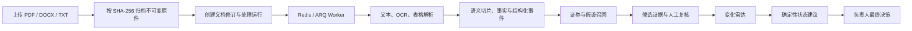

# AI Investment Copilot 开发进展与下一步计划

> 最后更新：2026-08-13
>
> 当前分支：`mvp-closed-loop-integrated`
>
> 本轮基线提交：`144df00`；P0-0、P0-1～P0-3 与 P1 改动在此基础上形成可评审提交
>
> 当前阶段：P0-0 与 P1 已于 2026-08-13 完成；下一阶段进入 P0-4 试点部署安全与可观测性

## 0. 2026-08-13 P0-0 / P1 完成更新

### P0-0 已关闭

- Docker Desktop 已恢复；本地 PostgreSQL 固定为 `pgvector/pgvector:0.8.6-pg16-bookworm`。
- `dev.ps1` 已修复从仓库外调用时找不到 `alembic.ini` 的工作目录缺陷；API、database、queue、
  worker、object_store 与 web 完整 ready。
- 新 TXT 已走通真实上传：MinIO object/version、revision、`ingestion_run`、Worker 受控下载、
  切片、事件、候选证据、embedding 和混合检索全部核验通过。
- 备份已包含数据库 dump、全部对象版本内容与 SHA-256；隔离恢复演练通过，恢复 head 为
  `0010_pgvector_rag_pilot`，3 个数据库对象版本完成内容哈希交叉核验。
- 迁移在专用临时数据库完成 `upgrade head → downgrade base → upgrade head`。

### P1 已完成第一轮试点

- 统一独立金标基线覆盖事件筛选、证券归属、假设匹配和方向：96.3% Precision、86.7%
  Recall、100.0% 归属准确率、71.2% 假设匹配、30.8% 方向准确率。
- 模型审计保存安全裁剪后的 usage；当前 5 次可计量调用包含 3,630 input tokens 与
  1,174 output tokens。未配置单价，成本保持 `null`。
- pgvector embedding 按 `ingestion_run_id + embedding_version` 增量生成，共 4,275 个活动切片
  （含本轮新上传）的 `hash-char-2gram-v1` 向量；旧产物不覆盖。
- 权限、证券、行业与时间先过滤，再做关键词 + 向量混合排序。受限身份的 59 条离线查询
  Recall@5 57.6%、Recall@10 61.0%、Top-1 引用正确率 30.5%、越权结果 0。
- 新建逻辑增加显式 RAG 开关；事件→假设召回默认关闭，启用后按事件稳定采样（默认 5%）。
  召回内容只作为候选上下文，人工发布和状态闸门不变。

详细验收见 `docs/operations/P1-效果评测与RAG试点.md`。P1 不等于生产级 RAG：当前 Top-1
正确率不足，应先补第二标注人、改用正式 embedding 并提高引用正确率，再扩大流量。

## 1. 结论摘要

AI Investment Copilot 已形成可运行的网页 MVP，并完成前三个 P0 产品与工程闭环：

- **P0-1：研究逻辑发布闭环。** 研究员可以在网页完成证券建档、AI 草稿生成、假设编辑、
  指标映射、发布就绪检查和人工发布。
- **P0-2：新资料可靠处理。** PDF、DOCX、TXT、扫描页和表格可以进入持久任务、结构化事件
  抽取、证券/假设归属、人工复核、死信重放和变化雷达链路。
- **P0-3：可持续研究资产层。** 新上传原件先归档到版本化对象存储；文档修订、处理运行和
  衍生产物 append-only 保存；历史正文已经完成语义衍生回填；检索、权限同步、逻辑版本修订
  和备份恢复工具已经落地。

当前应停止继续扩展本地 MVP 的隐式信任边界，优先完成 P0-4：正式身份认证与 RBAC、共享
试点部署、密钥管理、监控告警、跨机器备份和恢复演练。P1 已建立标注集和效果基线，并将
pgvector 混合召回作为默认关闭的小流量 RAG 试点。

## 2. 交付与运行状态

| 项目 | 当前状态 |
| --- | --- |
| 前后端整合 | React、FastAPI、PostgreSQL、Redis/ARQ 已在同一代码树联通 |
| 数据库迁移 | `0010_pgvector_rag_pilot (head)` |
| API 契约 | OpenAPI 49 个路径，代码与契约一致 |
| 本轮工作区 | P0-0、P0-1～P0-3 与 P1 已实现并完成提交前验证 |
| 本机服务 | Docker Desktop 正常；PostgreSQL/pgvector、Redis、MinIO 健康 |
| 环境例外 | P0-0 本机例外已关闭；共享部署与跨机器备份仍属于 P0-4 |

推荐使用统一脚本启动完整环境：

```powershell
cd E:\product\AI-Investment-Copilot
.\scripts\dev.ps1 up
.\scripts\dev.ps1 status
```

`dev.ps1 up` 会启动或复用 PostgreSQL、Redis 和 MinIO，执行迁移，初始化带版本控制、
Object Lock 和生命周期策略的 bucket，然后启动 API、Worker 和 Web。只有数据库、队列、
Worker 和对象存储全部健康时 `/health/ready` 才返回 ready。

停止本轮进程：

```powershell
.\scripts\dev.ps1 down
```

如只需启动前端，且 API 已在 `127.0.0.1:8000` 运行：

```powershell
cd E:\product\AI-Investment-Copilot\web
npm install       # 首次启动或 package-lock/package.json 变化后执行
npm run dev
```

## 3. 当前已实现能力

### 3.1 研究逻辑创建、配置与发布

研究员当前可以在网页完成：

1. 选择已有证券，或受控创建新的证券档案；
2. 输入研究观点，由 DeepSeek-compatible 模型生成标题、核心观点和 2～5 条可证伪假设；
3. 编辑假设内容、类型、核心/辅助级别、观察窗口和失效条件；
4. 搜索指标字典并配置预期方向、预期值、失效阈值、连续期数和预期来源；
5. 查看模型产生的指标、风险和失效建议，人工选择是否采用；
6. 按后端真实约束查看发布就绪清单，满足条件后人工发布 V1 并进入监控。

AI 只产生候选内容和状态建议。指标配置、证据确认、逻辑发布和状态变更都保留人工闸门。
新建逻辑可由研究员显式开启历史资产 RAG；事件→假设试点默认关闭并按事件稳定采样。
两条路径都只补充候选上下文，不改变人工闸门。

### 3.2 新资料处理与变化雷达



可靠性能力包括：

- HTTP 模型按 `event_extraction.schema.json` 输出结构化事件；不可用或不合约时明确降级到
  本地确定性规则，并保存抽取模式。
- PDF 扫描页使用本地 RapidOCR；PDF/DOCX 表格保留页码、表号、行号、单元格范围、抽取
  方法和 OCR 置信度。
- 文档、事件、证据和证据关联使用稳定 ID/指纹；重复上传或任务重放不会制造重复证据。
- 持久任务表保存 queued/running/retrying/succeeded/failed/dead_letter 状态，Redis 结果过期
  后仍可查询；失败和死信任务可以人工重放。
- 未归属证券、无法匹配假设、低置信事件和处理失败进入独立资料复核队列。
- 自动实体识别只给出候选；证券归属必须由研究员确认后才会重放进入雷达链。

### 3.3 数据与研究资产层

#### 原件与修订

- MinIO/S3-compatible bucket 保存按 SHA-256 寻址的不可变原件。
- bucket 启用版本控制、Governance Object Lock、保留期和非当前版本生命周期策略。
- PostgreSQL 只保存 `object_key`、`object_version_id`、内容哈希、来源、授权和权限元数据，
  Worker 使用受控临时副本处理，不依赖开发机永久绝对路径。
- 相同内容哈希复用既有修订；新解析器或切片策略只追加 `ingestion_run`，不覆盖旧产物。
- 文档业务删除采用墓碑：立即移出活动索引并标记修订，但不绕过对象保留策略。

历史数据库只有解析正文和外部 URL，无法从正文反推出原始 PDF/DOCX。系统没有伪造历史
原件，而是把 `missing_object_archive` 和 `pending_authorization` 明确保留为待治理资产。

#### 资产关系

当前模型已经包含：

- `source`：资料来源及授权状态；
- `industry`：行业主数据；
- `security_industry_membership`：证券行业归属及有效期；
- `document_security_relation`：一份文档关联多个证券；
- `document_revision`：不可变原件修订；
- `ingestion_run`：parser、chunker、extractor、embedding 版本和执行状态；
- `ingestion_artifact`：运行级 segment、fact、event 产物；
- `segment_search_index`：带可见性标签的活动检索投影。

目标关系保持为：

```text
document
  └─ document_revision（不可变原件、哈希、来源、授权）
       └─ ingestion_run（处理组件版本、状态、时间与质量摘要）
            ├─ segment artifact
            ├─ fact artifact
            ├─ event artifact
            └─ 可重建检索索引
```

#### 检索、权限与重建

- 当前资产搜索使用 PostgreSQL `tsvector`，并为中文和子串场景提供 ILIKE fallback。
- 查询始终带入当前用户的可见性标签；权限变化会同步更新检索投影。
- 重建时为每个文档修订选择最新成功运行；新成功运行会替换活动投影，但历史运行产物保留。
- 删除文档会立即移出活动索引；索引是可重建衍生物，不是事实源。
- pgvector/embedding 已作为 P1 试点接入；按运行与版本增量生成，混合检索默认只提供候选上下文。

### 3.4 研究逻辑版本与发布后修订

`thesis_version` 现在会冻结发布当时的：

- 逻辑字段、假设和指标映射；
- 预期方向/数值、失效阈值、连续期数和预期来源；
- 已确认证据、原文 locator、数据截止时间；
- 规则版本、模型版本、修改原因和变更字段。

已发布逻辑可以创建修订草稿，支持差异预览、草稿 revision 乐观锁和 base version 并发保护。
发布修订时会验证负责人、版本、原因和核心假设，原子更新逻辑、假设与指标映射，并生成新的
不可变版本。例如当前 V1 经过修订后生成 V2，V1 永久保留。

### 3.5 资产治理页面与 API

前端新增“资产治理”导航与页面，展示真实资产盘点、历史回填状态、原件/授权缺口，并支持：

- 权限感知的文档切片检索；
- 搜索索引重建；
- 文档权限同步和墓碑删除；
- 有原件修订的文档重新处理；
- 已发布逻辑的修订、保存、差异预览和发布。

对应资产 API 包括 `/api/assets/inventory`、`/api/assets/search`、索引重建、权限更新、文档
删除、重新处理和 thesis revision 系列端点。

## 4. 当前资产盘点

截至 2026-08-13，本机 PostgreSQL 的只读盘点为：

| 项目 | 数量 | 说明 |
| --- | ---: | --- |
| 文档 | 3,790 | 当前业务文档 |
| 文档修订 | 3,790 | 已为全部历史文档补建 revision |
| 处理运行 | 7,580 | 旧运行与 semantic-v1 运行各 3,790 次 |
| 规范 `document_segment` | 3,979 | 保留原表，不被历史回填覆盖 |
| semantic-v1 运行 | 3,790 | 历史正文追加的语义处理运行 |
| 运行级 segment 产物 | 7,789 | legacy 3,979 + semantic 3,810 |
| 运行级 fact 产物 | 1 | 当前历史正文可确定抽取出的事实 |
| 运行级 event 产物 | 7,576 | legacy 与 semantic 运行分别保留 |
| 活动检索切片 | 3,810 | 覆盖 3,790 个文档 |
| 待确认授权 | 3,790 | 不可通过代码自动推定 |
| 缺少对象存储原件 | 3,790 | 需找回真实来源文件后按哈希归档 |

回填使用 append-only `semantic-v1` 运行。它按句子边界生成确定性语义切片，并保留旧的
`legacy-single-v1` 运行和规范表数据，因此可以比较处理版本或再次重建索引。

相关命令：

```powershell
cd E:\product\AI-Investment-Copilot
.\.venv\Scripts\python.exe -m scripts.asset_inventory
.\.venv\Scripts\python.exe -m scripts.backfill_asset_derivatives
.\.venv\Scripts\python.exe -m scripts.rebuild_search_index
```

三个命令均可重复执行；回填不会覆盖既有运行，已存在的相同版本运行不会重复生成。

## 5. 备份、恢复与数据保护

本地 Compose 已为 PostgreSQL 开启 WAL archive，并使用独立 `postgres-wal` volume。MinIO
使用独立 `minio-data` volume。备份命令为：

```powershell
cd E:\product\AI-Investment-Copilot
.\scripts\backup_local.ps1
```

脚本会生成：

- PostgreSQL custom-format dump；
- 数据库 dump 的 SHA-256；
- MinIO 全部对象版本与删除标记清单；
- 对象版本清单的 SHA-256；
- 关联上述文件的总 manifest。

Docker volume 不是跨机器备份。进入共享试点前，必须把数据库基础备份、WAL、MinIO 数据或
等价的远端对象复制到另一台机器或受控备份库，并在隔离环境完成 PITR 与随机原文哈希核验。
详细步骤见 `docs/operations/P0-3-资产备份恢复与回填.md`。

## 6. 质量与验收结果

当前最终门禁结果：

| 验证项 | 结果 |
| --- | --- |
| 后端单元与契约测试 | `288 passed, 1 skipped` |
| PostgreSQL 集成测试 | `42 passed` |
| Ruff 与格式检查 | 通过，199 个文件格式一致 |
| mypy | 通过，93 个源文件无问题 |
| Import Linter | 6 个架构契约通过，0 broken |
| AI Schema | 3 个 Schema，0 个问题 |
| OpenAPI | 49 个路径，契约与代码一致 |
| React | TypeScript/Vite 生产构建和 ESLint 通过 |
| 数据库迁移 | `0010_pgvector_rag_pilot (head)`；head→base→head 隔离往返通过 |
| 浏览器验收 | 资产治理真实数据、权限检索和发布后修订入口正常，控制台无错误 |

浏览器验收实际发现并修复了两个仅靠静态测试不易暴露的问题：资产盘点 API 漏返回
`pending_authorization`/`missing_object_archive`，以及搜索 SQL 在 PostgreSQL 中错误地在
表达式内引用 rank 别名。

## 7. 当前边界与风险

1. **历史原件和授权不能自动补造。** 3,790 篇历史文档只有正文/URL，必须找回真实原文件并
   由数据负责人确认授权后才能关闭治理缺口。
2. **鉴权仍是本地 MVP。** 当前使用受信任请求头和硬编码管理角色，不适合共享或公网部署。
3. **OCR、表格与实体识别仍需业务金标评测。** 复杂版面、低质量扫描、多证券文件和子公司
   消歧可能进入人工复核，目前没有足够数据证明召回率与准确率。
4. **RAG 仍是低效果试点。** 当前 Top-1 引用正确率只有 30.5%，embedding 是离线哈希基线；
   默认关闭，不能用于自动发布或扩大流量。
5. **可观测性尚未生产化。** 已有持久任务、重试、死信和恢复，但缺 Prometheus 指标、告警、
   分布式追踪、容量阈值和多实例故障演练。
6. **跨机器备份尚未执行。** 本机成套备份与隔离恢复已通过，但仍需真实异机复制与 PITR。

## 8. 下一步优先级

### P0-0：关闭交付与环境例外（已完成）

1. 恢复 Docker Desktop，运行 `dev.ps1 up` 并确认 database、queue、worker、object_store
   全部 ready。
2. 上传一个新的 PDF/DOCX/TXT，核对 MinIO object/version、数据库 revision/run、Worker
   受控下载、切片/事件产物和检索结果。
3. 实际执行一次数据库与对象版本清单备份，并在隔离环境做恢复演练。
4. 整理当前工作区为可评审提交并推送特性分支；`contracts/` 和迁移变更由至少一个消费方
   审核。

验收标准：新成员拉取远端分支、配置 `.env` 并执行 `dev.ps1 up` 后，可以复现全套环境与
新上传链路；备份可以在隔离环境恢复并通过哈希抽检。

### P0-4：试点部署安全与可观测性

1. 接入正式 JWT/OIDC 和服务端 RBAC，移除硬编码身份与管理角色。
2. 增加多用户、跨团队、删除后检索和对象访问的越权测试。
3. 为 API、Worker、模型调用、任务积压、重试、死信和处理延迟增加指标、追踪与告警。
4. 固化共享试点 Compose/部署配置、密钥注入、资源限额和滚动重启流程。
5. 落实跨机器数据库/WAL/对象存储备份、保留期限和定期恢复演练。

验收标准：系统可在共享试点环境持续运行，重启不丢任务，权限和审计满足产品红线，关键
故障可以被及时发现并按运行手册恢复。

### P1：先建立效果评测，再试点 RAG（第一轮已完成）

1. 建立事件抽取、证券归属、假设匹配和方向判断的人工金标集。
2. 统计候选证据采用率、驳回率、人工复核耗时、重复提醒率和模型成本。
3. 在 PostgreSQL 接入 pgvector，按 `ingestion_run` 和模型版本增量生成 embedding。
4. 使用证券、行业、时间和权限过滤后的关键词 + 向量混合召回。
5. 离线验证召回率、引用正确率和越权泄漏，再小流量接入“事件到假设召回”。

RAG 不用于权限判断、去重、指标计算、失效判定或最终状态变更。这些能力继续由数据库、
稳定指纹、确定性规则和人工闸门负责。

### P2：扩大覆盖与协作

- 扩展更多行业、证券与持续数据源；
- 增加订阅、提醒、评论、任务分派和团队协作；
- 增加投资组合视角、证券间影响传播和外部数据连接器。

## 9. 推荐推进顺序

1. 提交、推送并完成本轮契约和迁移的消费方协作评审；
2. 完成 P0-4 的身份、权限、共享部署、监控和跨机器备份；
3. 为金标增加第二标注人并计算一致性；
4. 替换正式 embedding，在默认关闭的小流量事件→假设试点收集采用率、耗时与引用反馈；
5. 通过安全、稳定性和效果验收后扩大公司范围并进入多人试点。

下一个最重要的端到端验收场景是：**一只原样例范围之外的新证券，从建档、创建并发布
逻辑，到上传新资料、归档不可变原件、形成可追溯候选证据、进入雷达并完成人工处理，全程
不需要数据库脚本，同时可以通过版本快照、原文 locator 和处理运行版本复盘当时结论。**
